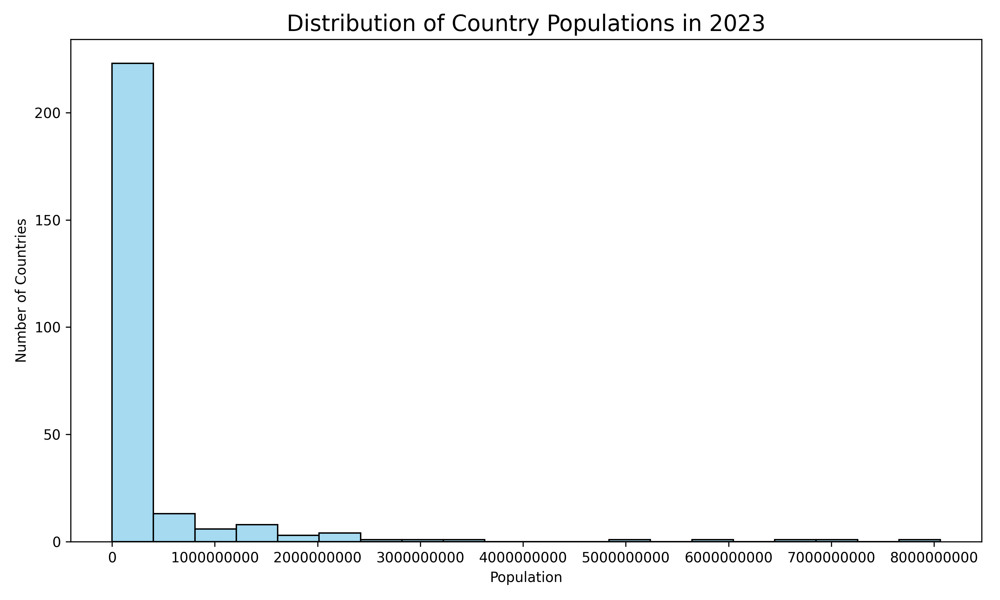

# PRODIGY_DS_1
# 🌍 World Bank Population Visualization

This project visualizes global population data using the **World Bank - Total Population (SP.POP.TOTL)** dataset.

## 📈 Objective

- Visualize **Top 10 most populous countries** in 2023 using a **bar chart**
- Show **distribution of countries by population** using a **histogram**

## 📁 Dataset

- Source: [World Bank Open Data](https://data.worldbank.org/indicator/SP.POP.TOTL)
- Downloaded in CSV format
- Contains population data for countries from 1960 to 2023

## 🛠️ Tools Used

- Python 🐍
- Pandas 🧮
- Seaborn 🎨
- Matplotlib 📊

## 📊 Visualizations

### 🔹 Bar Chart
Shows the top 10 most populous countries in 2023.

### 🔹 Histogram
Shows the distribution of all countries' populations in 2023.

